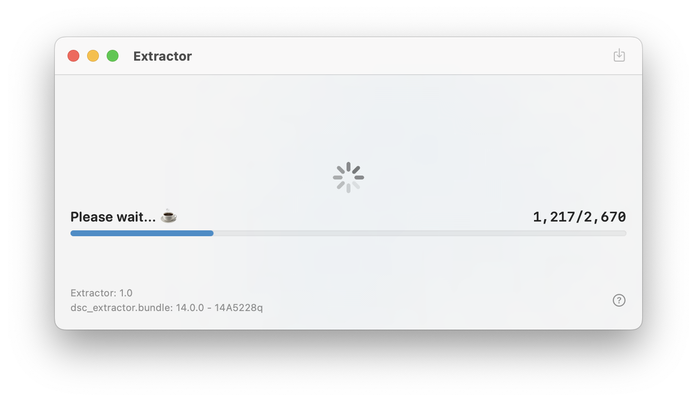

# DYLDExtractor

DYLDExtractor is a tool wrapping around the `dsc_extractor.bundle` calling `dyld_shared_cache_extract_dylibs_progress` to get frameworks and libraries extracted from iOS dyld shared cache.

## Preview



## About `dsc_extractor.bundle`

The `dsc_extractor.bundle` comes from your Xcode. The main purpose of packaging it within the app is to solve problem on older system. Eg: extracting iOS 16's cache for debug symbol on macOS 12 which requires Xcode 14 that is over 10GB you dont want to download.

```
➜  pwd
/Applications/Xcode.app/Contents

➜  find . -name "dsc_extractor.bundle"
./Developer/Platforms/AppleTVOS.platform/usr/lib/dsc_extractor.bundle
./Developer/Platforms/iPhoneOS.platform/usr/lib/dsc_extractor.bundle
./Developer/Platforms/WatchOS.platform/usr/lib/dsc_extractor.bundle
```

## Command Line Usage

To use this tool in command line without initialize GUI, add the dyld shared cache path and output path to the parameter. Make sure file does not exists at output.

```
usage: extractor /path/to/dyld_shared_cache /path/to/output
```

Example:

```
➜  ./DYLDExtractor.app/Contents/MacOS/DYLDExtractor ./com.apple.dyld/dyld_shared_cache_arm64e ./out

[*] bundle was loaded successfully
[*] dyld_shared_cache_extract_dylibs_progress at 0x10437a360
[*] calling extract from com.apple.dyld/dyld_shared_cache_arm64e to out
......
[*] extractor result: 0
```

## Use Customized dsc_extractor.bundle

When `dsc_extractor.bundle` exists at the same path with the executable, that `dsc_extractor.bundle` will be loaded instead of app bundle. With this kind of usage, you can move the binary out of the application bundle and integrated it within your script.

```
➜  ls
dsc_extractor.bundle      extractor

➜  ./extractor ./com.apple.dyld/dyld_shared_cache_arm64e ./out
[*] dsc_extractor.bundle was overwritten by current path environment
```

## LICENSE

[MIT License](./LICENSE)

---

Copyright © 2022 Lakr Aream. All Rights Reserved.
